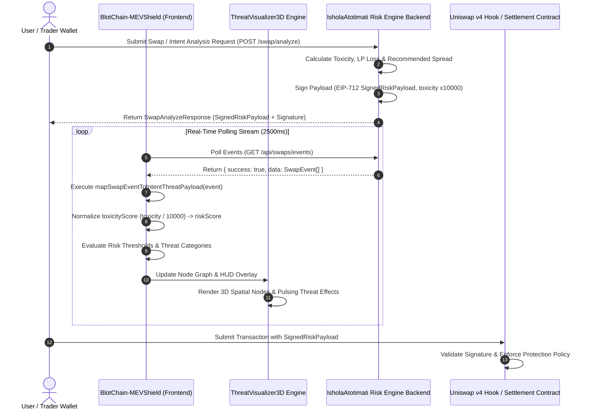

# BlotChain-MEVShield — IsholaAtotimati Risk Engine Adapter Documentation 🛡️⚡

> **Event:** ETHOnline 2026 (Continuity Track)
> **Backend Reference:** [IsholaAtotimati/Uniswap_Mev](https://github.com/IsholaAtotimati/Uniswap_Mev) (`babackend/src`)
> **Adapter Module:** `src/services/partnerBackend.ts`

---

## 📌 Executive Summary & Repository Status

**BlotChain-MEVShield** is a real-time 3D/VR MEV threat visualizer and protection suite built with React 18, Three.js, and WebGL. It processes transaction intents and mempool intelligence, rendering spatial node graphs of user wallets, liquidity pools, router contracts, and settlement attestations.

To support live risk evaluation and off-chain signed risk policies, BlotChain integrates with the **IsholaAtotimati/Uniswap_Mev** risk engine backend. The adapter (`src/services/partnerBackend.ts`) acts as a transformation bridge, converting raw backend swap analysis events and EIP-712 risk attestations (`SignedRiskPayload`) into standardized `IntentThreatPayload` structures consumed directly by `ThreatVisualizer3D` and the HUD interface.

---

## 🏗️ System Architecture & Interaction Flow

The interaction architecture separates risk calculation and signature generation on the Node.js backend from spatial 3D rendering on the frontend.

### Interaction Sequence Diagram



---

## 🔌 API Endpoint Reference

The backend risk engine exposes three core endpoints:

### 1. `POST /swap/analyze`
Submits swap parameters to compute liquidity risk and return an EIP-712 signed payload.
- **Request:** `{ sender, pool, tokenIn, tokenOut, amountIn, minAmountOut }`
- **Response:** `SwapAnalyzeResponse`
  ```json
  {
    "status": "signed",
    "settlementId": "0x7a8...3b9",
    "payload": {
      "poolId": "0x88e4a07e5e1563880ba0e8382d56a298516d2994",
      "expectedLpLoss": 0.0012,
      "expectedLeakage": 0.0004,
      "toxicityScore": 2800,
      "recommendedSpread": 15,
      "settlementToken": "USDC",
      "settlementAmount": 500000,
      "destinationDomain": 1,
      "recipient": "0x123...890",
      "expiry": 1700000000,
      "nonce": 42,
      "signer": "0x987...321"
    },
    "signature": "0xabcdef...",
    "txHash": null,
    "settlementStatus": "PENDING"
  }
  ```

### 2. `POST /api/analyze`
Generates quick risk telemetry without signing off-chain settlement attestations.
- **Response:** `{ riskScore, toxicity, recommendedSpread, feePercent, pool, riskLevel }`

### 3. `GET /api/swaps/events`
Returns live swap events processed by the risk engine, polled by BlotChain frontend for continuous 3D monitoring.
- **Response:** `FetchSwapEventsResult` (`{ success: boolean, data: SwapEvent[], timestamp: number }`)

---

## 🔀 Data Mapping Schema & Normalization

### 1. Toxicity & Risk Score Calculation
On the backend (`IsholaAtotimati/Uniswap_Mev`), `toxicityScore` is stored as an integer scaled by `10000` (e.g., a toxicity fraction of `0.28` is encoded as `2800`). The adapter normalizes this back to a `0.0 – 1.0` float:

$$\text{riskScore} = \text{clamp}\left(\frac{\text{toxicityScore}}{10000}, 0.0, 1.0\right)$$

### 2. Color Coding & Threat Vectors
- **Critical Risk ($\text{riskScore} \ge 0.7$):**
  - Color: `#FF0055` (Neon Red)
  - Threat Vectors: `SANDWICH_ATTACK`, `TOXIC_FLOW`, `SLIPPAGE_EXPLOIT`
  - Node Animation: High-frequency pulsation (`isPulsing: true`)
- **Warning Risk ($0.4 \le \text{riskScore} < 0.7$):**
  - Color: `#f97316` (Orange)
  - Threat Vectors: `TOXIC_FLOW`, `SLIPPAGE_EXPLOIT` (if `recommendedSpread > 0`)
- **Safe Risk ($\text{riskScore} < 0.4$):**
  - Color: `#22c55e` (Emerald Green)
  - Breathing animation

### 3. Graph Node Construction

Each `SwapEvent` generates three distinct 3D graph nodes:

| Node ID | Type | Label | Color | Details Included |
| :--- | :--- | :--- | :--- | :--- |
| `wallet_{eventId}` | `WALLET` | ENS name or `short(sender)` | `#22c55e` | Wallet address, ENS, `amountIn`, token pair intent, status |
| `pool_{poolId}` | `DEX_POOL` | `Pool {poolId}` | Dynamic (`#22c55e` / `#f97316` / `#FF0055`) | Pool address, Toxicity %, recommended spread (bps) |
| `settlement_{settlementId}` | `CONTRACT` | `Settlement ({settlementToken})` | `#22c55e` if valid else `#FF0055` | Settlement ID, protection fee in USDC, verification state |

---

## 💻 TypeScript Integration Code Example

Below is a usage example demonstrating how to poll the backend and pass mapped payloads to `ThreatVisualizer3D`:

```typescript
import { fetchLiveThreatPayloads, mapSwapEventToIntentThreatPayload } from './services/partnerBackend';

// 1. Fetch live events from IsholaAtotimati risk backend
const backendUrl = "https://mev-backend.example.com";
const ensCache = { "0x123...456": "trader.eth" };

async function loadRealTimeThreats() {
  try {
    const payloads = await fetchLiveThreatPayloads(backendUrl, ensCache);
    console.log(`Loaded ${payloads.length} live threat payloads`);
    // Pass payloads[0] to <ThreatVisualizer3D payload={payloads[0]} />
  } catch (error) {
    console.error("Failed to fetch live MEV threat data:", error);
  }
}
```

---

## 🛠️ Verification & Build Status

The adapter has been verified against the codebase build and lint pipelines:
- **Build Command:** `npm run build` (Vite 5 TypeScript compilation) — **PASSED**
- **Linter:** `npm run lint` (ESLint v9) — **PASSED**
